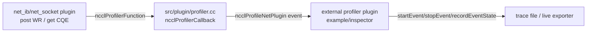

# NCCL_ENABLE_NET_PROFILING 详解

> 分析范围：`src/transport/net_ib/`、`src/transport/net_socket.cc`、`src/plugin/profiler.cc`、`src/include/plugin/nccl_profiler.h`、`plugins/profiler/`

---

## 1. 它是什么

`NCCL_ENABLE_NET_PROFILING` 是一个**编译期宏**，用于控制 NCCL 是否在网络传输层（主要是 `net_ib` 和 `net_socket`）插入性能剖析代码。

- 当该宏被定义时，网络插件内部会调用 `ncclProfilerFunction`（即 NCCL core 提供的 profiler 回调），把**每个网络工作请求（Work Request）的生命周期**上报给外部 profiler 插件。
- 当该宏未定义时，所有网络层 profiling 代码被编译掉，无任何运行时开销。

它本身**不产生可见输出**，只是打开网络层向 profiler 插件“送事件”的通道；真正的数据收集、存储、可视化由**profiler plugin**完成。

---

## 2. 如何打开

### 2.1 Make 构建

在 `makefiles/common.mk` 中：

```makefile
ifneq ($(NET_PROFILER), 0)
CXXFLAGS += -DNCCL_ENABLE_NET_PROFILING=1
endif
```

编译时指定 `NET_PROFILER=1`：

```bash
cd /root/workspace/nccl
make -j src.build NET_PROFILER=1
```

### 2.2 CMake 构建

在 `CMakeLists.txt` 中：

```cmake
if(NET_PROFILER)
    add_definitions(-DNCCL_ENABLE_NET_PROFILING=1)
endif()
```

配置时打开：

```bash
cd /root/workspace/nccl
mkdir -p build && cd build
cmake .. -DNET_PROFILER=ON
make -j
```

### 2.3 运行时启用 profiler 插件

仅仅打开 `NCCL_ENABLE_NET_PROFILING` 还不够，还需要加载一个 **profiler plugin**（例如 NCCL 自带的 example profiler）：

```bash
export NCCL_PROFILER_PLUGIN=/path/to/libnccl-profiler.so
# 或把插件目录加入 LD_LIBRARY_PATH
export NCCL_PROFILE_EVENT_MASK=0x80   # ncclProfileNetPlugin (1<<7)
export NCCL_PROFILE_DUMP_FILE=/tmp/nccl_trace
```

`NCCL_PROFILE_EVENT_MASK` 中 `ncclProfileNetPlugin`（bit 7，值为 128/0x80）控制网络插件事件是否被采集。如果只想看网络事件，可只设这个 bit；但通常为了关联上下文，需要同时启用父事件（如 `ncclProfileProxyStep`、`ncclProfileProxyOp` 等）。

---

## 3. 它能提供什么信息

### 3.1 net_ib 插件提供的信息

在 `src/include/plugin/profiler/net_ib_v1.h` 中定义了 IB 网络事件的数据结构：

```cpp
#define NCCL_PROFILER_NET_IB_VER 1

enum {
  ncclProfileQp = (1 << 0),
};

typedef struct {
  uint8_t type;        // event type (plugin defined)
  union {
    struct {
      int device;      // network device id
      uint64_t wr_id;  // work request id
      int opcode;      // ibv opcode
      int qpNum;       // QP number
      size_t length;   // work request data length
    } qp;
  };
} ncclProfilerNetIbDescr_v1_t;
```

也就是说，对于每个 IB 工作请求，profiler 能拿到：

| 字段 | 含义 |
|------|------|
| `device` | 使用的网络设备索引 |
| `wr_id` | Work Request ID，用于匹配完成事件 |
| `opcode` | IBV opcode，如 `IBV_WR_RDMA_WRITE`、`IBV_WR_RDMA_WRITE_WITH_IMM`、`IBV_WR_RDMA_READ`、`IBV_WR_SEND_WITH_IMM` 等 |
| `qpNum` | QP（Queue Pair）编号 |
| `length` | 该 WR 的数据长度 |

### 3.2 net_socket 插件提供的信息

在 `src/include/plugin/profiler/net_socket_v1.h` 中定义了 socket 网络事件：

```cpp
#define NCCL_PROFILER_NET_SOCKET_VER 1

enum {
  ncclProfileSocket = (1 << 0),
};

typedef struct {
  uint8_t type;
  union {
    struct {
      int fd;
      int op;
      size_t length;
    } sock;
  };
} ncclProfilerNetSockDescr_v1_t;
```

提供：socket fd、操作类型、数据长度。

### 3.3 事件触发点

在 `src/transport/net_ib/p2p.cc` 中，以下条件编译块会在启用 profiling 时生效：

- `ncclIbMultiSend`：对每个 QP 上的每个 WR 调用 `ncclProfilerNetEventStart`。
- `ncclIbIsend`：保存 `phandle`（父 proxy step 事件句柄）。
- `ncclIbIrecv`：post receive WR 时启动 QP 事件。
- `ncclIbTest` / `ncclIbCompletionEventProcess`：收到 CQE 后调用 `ncclProfilerNetEventStop`。
- `ncclIbIflush`：flush 操作也会生成 QP 事件。

简言之，它能精确到**每个 WR 的 post 和 completion 时间点**。

---

## 4. 数据如何流动



### 4.1 网络插件侧

在 `src/transport/net_ib/common.h` 中声明了全局回调指针：

```cpp
extern ncclProfilerCallback_t ncclProfilerFunction;
```

在 `src/transport/net_ib/init.cc` 的 `ncclIbInitDevices` 中初始化：

```cpp
ncclProfilerFunction = profFunction;
```

当 `NCCL_ENABLE_NET_PROFILING` 生效时，网络插件调用：

```cpp
int64_t pluginId = NCCL_PROFILER_NET_TYPE_IB | NCCL_PROFILER_NET_IB_VER;
req->pInfo[0].data.type = ncclProfileQp;
req->pInfo[0].data.qp.device = devIndex;
req->pInfo[0].data.qp.wr_id = comm->wrs[r].wr_id;
req->pInfo[0].data.qp.opcode = comm->wrs[r].opcode;
req->pInfo[0].data.qp.qpNum = qp->qp->qp_num;
req->pInfo[0].data.qp.length = comm->sges[r].length;

ncclProfilerFunction(
    &reqs[r]->pInfo[0].qpEventHandles[nEventHandles],
    ncclProfilerNetEventStart,
    pHandle,
    pluginId,
    &reqs[r]->pInfo[0].data);
```

### 4.2 NCCL core 侧桥接

`src/plugin/profiler.cc` 中的 `ncclProfilerCallback` 把网络事件转换为 `ncclProfileNetPlugin` 事件：

```cpp
ncclResult_t ncclProfilerCallback(void** eHandle, int type, void* pHandle, int64_t pluginId, void* extData) {
  if (type == ncclProfilerNetEventStart) {
    struct ncclProxyEventHandle* p = (struct ncclProxyEventHandle*)pHandle;
    struct ncclProxySubArgs* sub = p->subArgPtr;
    if (sub->eActivationMask & ncclProfileNetPlugin) {
      ncclProfilerEventDescr_t eDescr = {0};
      eDescr.type = ncclProfileNetPlugin;
      eDescr.parentObj = p->stepEventHandle;   // 挂到 ProxyStep 事件下
      eDescr.rank = sub->rank;
      eDescr.netPlugin.id = pluginId;          // 高 16 bit 网络类型 + 低 16 bit 版本
      eDescr.netPlugin.data = extData;         // 指向 ncclProfilerNetIbDescr_v1_t
      ncclProfiler->startEvent(sub->profilerContext, eHandle, &eDescr);
    }
  } else if (type == ncclProfilerNetEventStop) {
    ncclProfiler->stopEvent(*eHandle);
  } else if (type == ncclProfilerNetEventUpdate) {
    // record state update
  }
}
```

### 4.3 事件层级

NCCL profiler 事件有父子层级。网络事件通常挂在 `ProxyStep` 下面：

```
Group API event
   └─ Collective API event
      └─ Collective event
         └─ ProxyOp event
            └─ ProxyStep event
               └─ NetPlugin event   <-- 这里才是网络 WR 事件
```

因此，打开 `ncclProfileNetPlugin` 时，最好也打开父事件，才能在 trace 中看到完整上下文。

---

## 5. 信息以什么方式呈现

NCCL 不内置 profiler UI，数据呈现完全取决于加载的 **profiler plugin**。

### 5.1 官方 example profiler：Chrome Trace JSON

`plugins/profiler/example/` 中的示例插件会把所有事件输出为 **Chrome Trace Format** 的 JSON 文件：

```bash
${NCCL_PROFILE_DUMP_FILE}_${commHash}_${rank}.json
```

net_ib 事件在 JSON 中表现为：

```json
{
  "name": "Qp",
  "cat": "NET_IB",
  "ph": "b",
  "id": 0,
  "pid": 12345,
  "tid": 1,
  "ts": 119710.632996,
  "args": {
    "device": 0,
    "qp_num": 123456,
    "opcode": 2,
    "wr_id": 42,
    "size": 524288
  }
}
```

其中：
- `ph: "b"` / `ph: "e"` 分别表示事件开始和结束。
- `cat: "NET_IB"` 表示这是 IB 网络事件。
- `args` 中包含 device、QP 号、opcode、WR id、数据大小。

可以用 Chrome/Chromium 的 `chrome://tracing` 或 [ui.perfetto.dev](https://ui.perfetto.dev) 打开可视化。

### 5.2 inspector plugin：Prometheus / 结构化导出

`plugins/profiler/inspector/` 提供了另一种插件实现，支持：
- 实时 Prometheus metrics 暴露（`inspector_prom.cc`）。
- JSON 结构化导出（`inspector_json.cc`）。
- Python 性能摘要导出器（`inspector/exporter/example/`）。

### 5.3 自定义 plugin

用户可以自己实现 `ncclProfiler_vX_t` 接口，把事件输出到：
- 日志文件
- 数据库
- 时序监控系统
- 自定义可视化工具

---

## 6. 典型使用步骤

以查看 IB 网络层 WR 生命周期为例：

### 6.1 编译 NCCL 时打开网络 profiling

```bash
cd /root/workspace/nccl
make -j src.build NET_PROFILER=1
```

### 6.2 编译 example profiler 插件

```bash
cd /root/workspace/nccl/plugins/profiler/example
make
```

得到 `libnccl-profiler.so`。

### 6.3 运行测试程序

```bash
export NCCL_PROFILER_PLUGIN=/path/to/libnccl-profiler.so
export NCCL_PROFILE_EVENT_MASK=0x80      # ncclProfileNetPlugin
export NCCL_PROFILE_DUMP_FILE=/tmp/nccl_trace
# 若需完整上下文，可设更大的 mask，例如 0x1FF
mpirun -np 2 ./nccl_tests/build/all_reduce_perf -b 8 -e 256M -f 2 -g 1
```

### 6.4 查看输出

每个 rank 会生成一个文件：

```bash
ls /tmp/nccl_trace_*.json
```

用 Chrome Tracing 打开即可看到每个 QP 的 post→complete 时间线。

---

## 7. 注意事项与开销

1. **编译期开关**：`NCCL_ENABLE_NET_PROFILING` 必须在编译时打开；运行时无法通过环境变量启用。
2. **运行时 mask**：即使编译打开了，也需要 `NCCL_PROFILE_EVENT_MASK` 包含 `ncclProfileNetPlugin` 才会真正采集网络事件。
3. **性能开销**：
   - 未打开时：profiling 代码被 `#ifdef` 完全剔除，零开销。
   - 打开但未启用 mask：只有少量分支判断，实际无事件创建。
   - 打开并启用 mask：每个 WR 会产生 start/stop 回调，有一定开销，主要用于调试分析，不适合生产全量常开。
4. **事件层级**：NetPlugin 事件通常作为 ProxyStep 的子事件；只开 NetPlugin 可能看不到完整调用链。
5. **插件版本**：NCCL core 支持 v1~v6 profiler API，会按 v6→v1 顺序尝试加载插件符号。

---

## 8. 总结

| 问题 | 答案 |
|------|------|
| `NCCL_ENABLE_NET_PROFILING` 是什么 | 编译期宏，控制网络层是否插入 profiler 回调 |
| 如何打开 | `make NET_PROFILER=1` 或 `cmake -DNET_PROFILER=ON` |
| 提供什么信息 | 每个 IB/Socket WR 的 device、QP/fd、opcode、wr_id、length、起止时间 |
| 信息如何呈现 | 通过 profiler plugin；example 插件输出 Chrome Trace JSON；inspector 插件输出 Prometheus/JSON |
| 典型用途 | 分析网络传输延迟、定位慢 WR、观察 QP 利用率、排查 NCCL 网络性能问题 |
