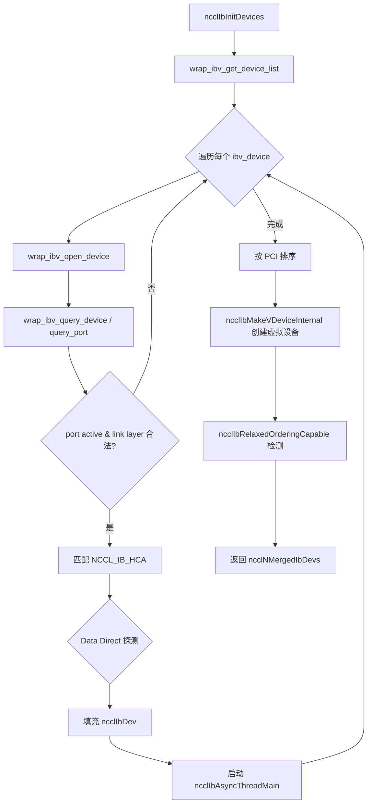
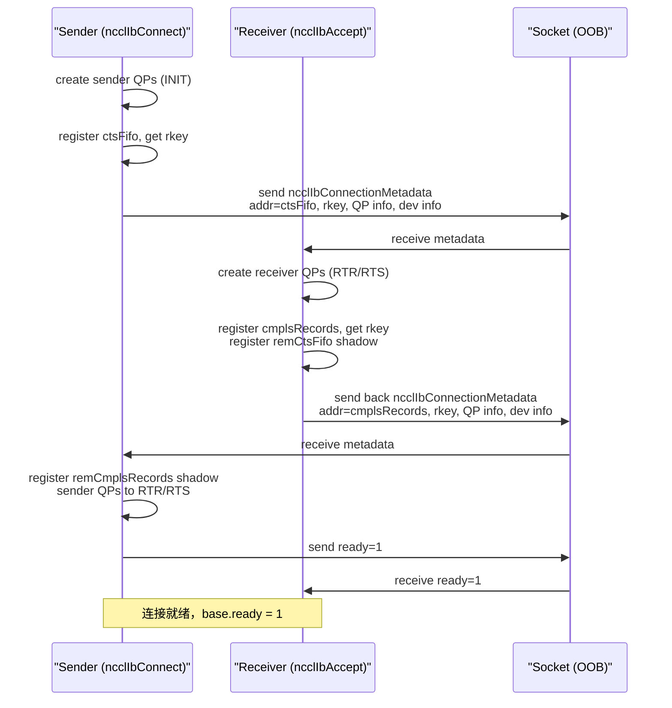
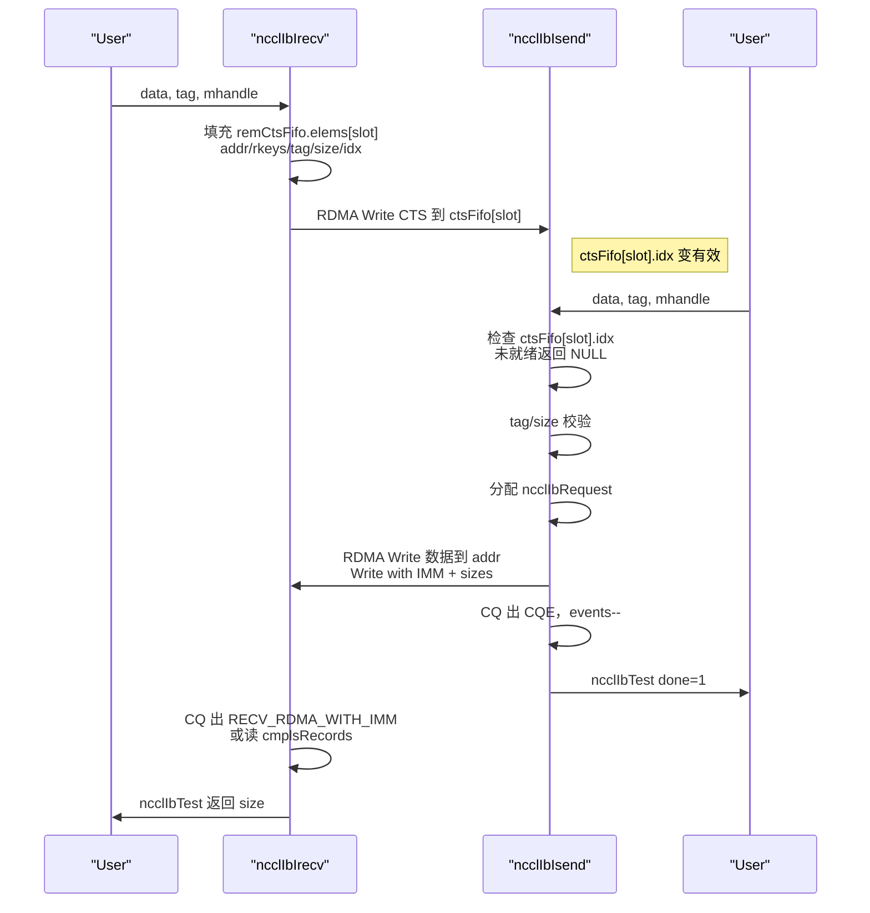
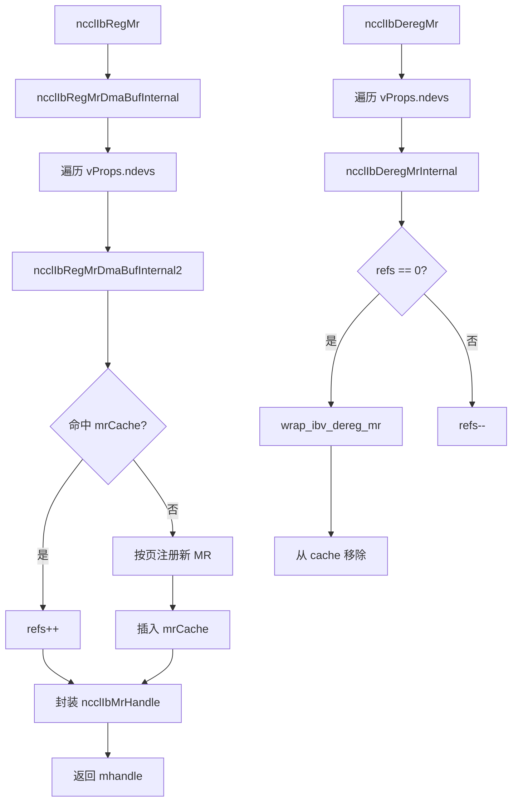
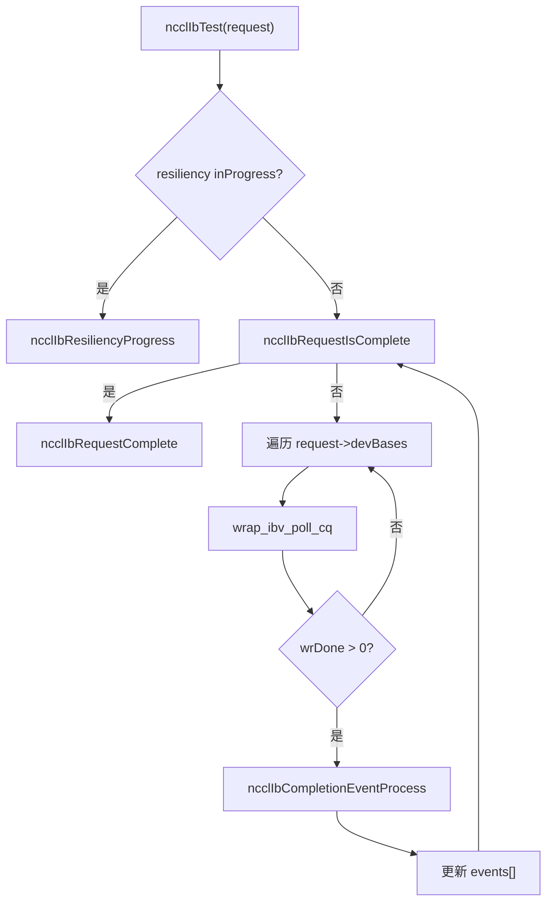
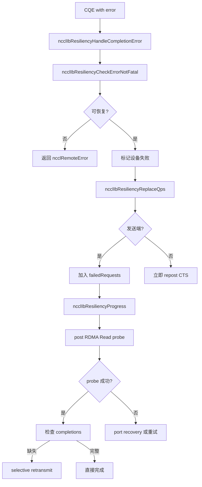

# NCCL `src/transport/net_ib` 代码全面 Review

> 分析范围：`src/transport/net_ib/` 下的核心源文件（不含 `gdaki/doca-gpunetio/` 这一 vendored DOCA 子目录）。
> 版本依据：当前仓库 NCCL 2.30.7 代码。

---

## 1. 目录与文件概览

```
src/transport/net_ib/
├── common.h / common.cc      # 全局设备、统计、通信基类、异步事件线程
├── connect.h / connect.cc    # QP 创建、RTR/RTS、连接建立元数据交换
├── p2p.h / p2p.cc            # 数据路径：isend/irecv/flush/test
├── p2p_resiliency.h/.cc      # 端口弹性（failover + 探测重传）
├── p2p_resiliency_recovery.h/.cc  # 端口恢复协议（alive/ack 状态机）
├── init.cc                   # IB 设备发现、虚拟设备构造、插件初始化
├── reg.cc                    # MR 注册/注销与缓存
├── gdr.cc                    # GDR / DMA-BUF / PeerMem 支持检测
├── gin.h / gin.cc            # GIN（GPU-initiated networking）与 RMA Proxy 封装
├── gdaki/
│   ├── gin_host_gdaki.h/.cc  # GDAKI（DOCA GPUNetIO）后端封装
│   └── doca-gpunetio/        # vendored DOCA GPUNetIO 头文件/源文件（本文不展开）
└── CMakeLists.txt
```

### 1.1 各文件职责

| 文件 | 主要职责 |
|------|----------|
| `common.h/cc` | 定义 `ncclIbDev`、`ncclIbMergedDev`、`ncclIbNetCommBase`、`ncclIbSendComm`、`ncclIbRecvComm`、`ncclIbQp`、`ncclIbRequest` 等核心结构；实现 `ncclIbAsyncThreadMain` 异步事件监听；导出 `ncclNetIb` vtable。 |
| `connect.h/cc` | QP 创建、状态机转换（INIT/RTR/RTS）、`ncclIbConnect` / `ncclIbAccept` 的 socket 元数据交换。 |
| `p2p.h/cc` | 核心数据路径：`ncclIbIsend`、`ncclIbIrecv`、`ncclIbMultiSend`、`ncclIbPostFifo`、`ncclIbIflush`、`ncclIbTest`。 |
| `p2p_resiliency.h/cc` | 设备失败检测、QP 替换、探测（probe）重传、请求状态机。 |
| `p2p_resiliency_recovery.h/cc` | 端口恢复异步线程、`alive` / `ack` 握手状态机、QP 重置与恢复。 |
| `init.cc` | `ncclIbInitDevices`：遍历 `ibv_device`、构造 `ncclIbDev`、合并虚拟设备 `ncclIbMergedDev`、自适应路由/OOO RQ/Data Direct 探测。 |
| `reg.cc` | MR 缓存、按页注册、DMA-BUF / relaxed ordering 支持。 |
| `gdr.cc` | `nv_peer_mem` / `nvidia_peermem` / DMA-BUF 能力探测。 |
| `gin.h/cc` | GIN 集体通信封装（all-gather/all-to-all）、RMA Proxy 的 put/get/flush/signal。 |

---

## 2. 核心数据结构

### 2.1 设备层：`ncclIbDev` / `ncclIbMergedDev`

```cpp
struct alignas(64) ncclIbDev {
  std::mutex mutex;
  int device;                 // ibv_device 索引
  uint64_t guid;
  uint8_t portNum;
  uint8_t link;               // IBV_LINK_LAYER_INFINIBAND / ETHERNET
  int speed;
  ibv_context* context;
  ibv_pd* pd;
  int pdRefs;
  char devName[MAXNAMESIZE];
  char* pciPath;
  int ar;                     // Adaptive Routing 是否开启
  uint32_t oooRqSize;         // Out-of-Order RQ 能力大小
  struct ncclIbStats stats;
  int dmaBufSupported;
  enum ncclIbProvider ibProvider;  // IB_PROVIDER_NONE / MLX5
  ...
};

struct alignas(64) ncclIbMergedDev {
  ncclNetVDeviceProps_t vProps;   // 虚拟设备包含的物理设备列表
  int speed;
  int16_t railId, planeId;
  char devName[MAX_MERGED_DEV_NAME];
};
```

- 每个物理 IB 端口对应一个 `ncclIbDev`。
- 通过 `ncclIbMakeVDevice` 可把多个物理 NIC（rail/plane 相同或用户指定）合并成 `ncclIbMergedDev`，对外呈现为一个虚拟设备。
- `ncclIbDevs[]` / `ncclIbMergedDevs[]` 为全局数组，`ncclNIbDevs` / `ncclNMergedIbDevs` 记录数量。

### 2.2 QP：`ncclIbQp`

```cpp
struct ncclIbQp {
  struct ibv_qp* qp;
  int devIndex;               // QP 所在本地设备
  int remDevIdx;              // 对端设备索引
  struct ibv_ece ece;         // Enhanced Connection Establishment
  int eceSupported;
  struct ncclIbQpInitAttr initAttr;
  struct ncclIbQpRtrAttr  rtrAttr;
  struct ncclIbQpRtsAttr  rtsAttr;
};
```

QP 在 `ncclIbNetCommBase::qps[]` 中静态分配，`activeQps[]` 指向当前实际使用的 QP。弹性恢复时只需改 `activeQps[]` 即可切换备用 QP。

### 2.3 通信基类：`ncclIbNetCommBase`

```cpp
struct alignas(32) ncclIbNetCommBase {
  ncclNetVDeviceProps_t vProps;
  bool isSend;
  struct ncclIbRequest reqs[NET_IB_MAX_REQUESTS];
  struct ncclIbQp qps[NCCL_IB_MAX_QPS];
  struct ncclIbQp* activeQps[NCCL_IB_MAX_QPS];
  uint64_t fifoHead;
  int nqps;
  int splitDataOnQps;
  int nDataQps;
  struct ncclSocket sock;
  int ready;
  int nRemDevs;
  bool remOooRq, localOooRq;
  int recvMatchingScheme;     // BY_INDEX / BY_ID
  struct ncclIbDevInfo remDevs[NCCL_IB_MAX_DEVS_PER_NIC];
  struct ncclIbStats stats;
  struct ncclIbResiliency* resiliency;
};
```

- `fifoHead`：按请求顺序递增，用于 CTS / completion records 数组索引。
- `recvMatchingScheme`：
  - `BY_INDEX`：接收端按 slot（`wr_id`）匹配。
  - `BY_ID`：接收端按 immediate data（request id % MAX）匹配；开启 OOO RQ 或弹性时必须使用。

### 2.4 发送端通信：`ncclIbSendComm`

```cpp
struct ncclIbSendComm {
  struct ncclIbNetCommBase base;
  struct ncclIbSendFifo ctsFifo[NET_IB_MAX_REQUESTS][NCCL_NET_IB_MAX_RECVS];
  struct ibv_sge sges[NCCL_NET_IB_MAX_RECVS];
  struct ibv_send_wr wrs[NCCL_NET_IB_MAX_RECVS + 1];
  struct ncclIbSendCommDev devs[NCCL_IB_MAX_DEVS_PER_NIC];
  struct ncclIbRequest* sendReqs[NET_IB_MAX_REQUESTS][NCCL_NET_IB_MAX_RECVS];
  int sendReqsCnt[NET_IB_MAX_REQUESTS];
  struct ncclIbRemCompletionsRecords remCmplsRecords;
  int ar;
  uint64_t putSignalScratchpad;
};
```

- `ctsFifo`：接收端通过 RDMA Write 写入 CTS（Clear-To-Send），发送端读取。
- `remCmplsRecords`：本地 shadow，用于把各 sub-request 大小写回接收端 completion records。
- `sendReqs[slot][r]`：指向 `base.reqs[]` 中对应请求，方便通过 CQE 快速检索。

### 2.5 接收端通信：`ncclIbRecvComm`

```cpp
struct ncclIbRecvComm {
  struct ncclIbNetCommBase base;
  struct ncclIbRecvCommDev devs[NCCL_IB_MAX_DEVS_PER_NIC];
  struct ncclIbRequest* recvReqs[NET_IB_MAX_REQUESTS];
  struct ncclIbRemCtsFifo remCtsFifo;
  struct ncclIbRequestCompletionRecord cmplsRecords[NET_IB_MAX_REQUESTS];
  int flushEnabled;
  bool prepostReceiveWorkRequests;
  struct ibv_recv_wr ibRecvWorkRequest;
};
```

- `remCtsFifo`：本地 shadow CTS 条目，通过 RDMA Write 发到发送端 `ctsFifo`。
- `cmplsRecords`：发送端把大小写进 `sizes[]`，接收端据此报告实际收到字节；`completions[]` 用于弹性探测。
- `prepostReceiveWorkRequests`：是否在 `ncclIbIrecv` 时预 post RQ WQE。

### 2.6 请求：`ncclIbRequest`

```cpp
struct ncclIbRequest {
  struct ncclIbNetCommBase* base;
  int type;                   // SEND / RECV / FLUSH / GIN_IPUT / GIN_IGET
  struct ncclSocket* sock;
  int events[NCCL_IB_MAX_DEVS_PER_NIC];       // 每设备待完成事件计数
  struct ncclIbNetCommDevBase* devBases[NCCL_IB_MAX_DEVS_PER_NIC];
  uint64_t id;
  int nreqs;
  union {
    struct { int size; void* data; uint32_t lkeys[...]; bool sentData[NCCL_IB_MAX_QPS]; } send;
    struct { struct ncclIbRequestCompletionRecord* cmplsRecords; int aggSize; } recv;
    struct { int rank; } iput;
    struct { int rank; } iget;
  };
};
```

- `events[]` 是完成检测核心：post 时按设备递增，CQE 到达时递减，全 0 即完成。
- `send.sentData[]` 记录数据是否已在某 QP 上发送，用于弹性选择性重传。

### 2.7 CTS / Completion Records 元数据

```cpp
struct ncclIbSendFifo {
  uint64_t addr;              // 接收端 buffer 地址
  uint64_t size;
  uint32_t rkeys[NCCL_IB_MAX_DEVS_PER_NIC];
  uint32_t nreqs;
  uint32_t tag;
  uint64_t idx;               // fifoHead + 1，作为就绪标记
};

struct ncclIbRequestCompletionRecord {
  int sizes[NCCL_NET_IB_MAX_RECVS];           // 发送端写入的实际大小
  bool completions[NCCL_IB_MAX_QPS];          // 接收端标记哪些 QP 已完成
};
```

---

## 3. 重要函数解析

### 3.1 初始化与设备管理

#### `ncclIbInitDevices`

- 打开所有 `ibv_device`，过滤 `NCCL_IB_HCA` 白名单。
- 查询每个 port 的 `portAttr`，计算 speed、link layer、AR、OOO RQ。
- 检测 Data Direct DMA 能力（mlx5dv）。
- 创建 `ncclIbDev` 并启动每设备 `ncclIbAsyncThreadMain` 异步事件线程。
- 按 PCI 路径排序，构造 `ncclIbMergedDevs`（每个物理设备先变成单设备虚拟设备，后续可能通过 `ncclIbMakeVDevice` 合并）。

#### `ncclIbMakeVDeviceInternal`

- 把多个 `ncclIbDev` 合并成一个 `ncclIbMergedDev`。
- 合并后 speed 相加、planeId 按位或、railId 不一致则置 `NCCL_NET_ID_UNDEF`。

#### `ncclIbGetProperties` / `ncclIbGetPhysProperties`

- 填充 `ncclNetProperties_t`：name、speed、pciPath、guid、`ptrSupport`（HOST/CUDA/DMABUF）、`maxRecvs`、`maxComms`、rail/plane 等。

### 3.2 连接建立

#### `ncclIbConnectImpl` / `ncclIbAcceptImpl`

- 异步状态机通过 socket 交换 `ncclIbConnectionMetadata`。
- 协商 `nqps`、`nDataQps`，处理本端/对端设备数不一致。
- 发送端先创建 QP 并发 metadata；接收端用对端 metadata 创建并连接 QP，再回传自己的 metadata。
- 关键元数据：
  - `addr` + `rkey`：发送端给出 `ctsFifo` 地址，接收端给出 `cmplsRecords` 地址。
  - QP info：qpn、devIndex、ECE。
  - dev info：lid、gid、mtu、link_layer、ib_port。

#### `ncclIbSenderQpsCreate` / `ncclIbReceiverQpsCreateToRts`

- QP 按设备条带化：QP index `i` 放在 `i % ndevs` 设备上。
- 创建 RC QP，INIT → RTR → RTS。
- 接收端 QP 需要 `REMOTE_WRITE | REMOTE_ATOMIC | REMOTE_READ`；发送端 QP 需要 `REMOTE_WRITE`。

#### `ncclIbQpCreate` / `ncclIbQpInit` / `ncclIbQpRtr` / `ncclIbQpRts`

- `ncclIbQpCreate`：调用 `wrap_ibv_create_qp` 或 `wrap_mlx5dv_create_qp`（OOO RQ 时）。
- `ncclIbQpInit`：INIT 状态，设置 PKey、port、access flags。
- `ncclIbQpRtr`：RTR 状态，填充 remote QPN、LID/GID、MTU、SL/TC。
- `ncclIbQpRts`：RTS 状态，设置 timeout、retry count。

### 3.3 数据路径

#### `ncclIbIsend`

1. 取 slot = `fifoHead % NET_IB_MAX_REQUESTS`。
2. 检查 `ctsFifo[slot][0].idx == fifoHead + 1`，未就绪返回 `*request = NULL`。
3. 校验 tag、size、addr/rkey 合法性。
4. 分配 `ncclIbRequest`，填充 send 信息，记录 lkeys。
5. multi-recv 时等 `sendReqsCnt[slot] == nreqs`，再调用 `ncclIbMultiSend`。
6. 递增 `fifoHead`。

#### `ncclIbMultiSend`

- 每个 sub-request 构造一个 `IBV_WR_RDMA_WRITE` WR。
- 最后一个 WR 通常为 `IBV_WR_RDMA_WRITE_WITH_IMM`，并带 `IBV_SEND_SIGNALED`。
- `immData`：
  - `BY_ID` 时为 request id。
  - `BY_INDEX` 时为发送大小（单请求）或被忽略（多请求，大小直接写 `cmplsRecords`）。
- 多 QP 时按请求大小均分，每个 QP 发一段。
- 多请求（nreqs > 1）时额外 RDMA Write 远程 `cmplsRecords[slot].sizes`。

#### `ncclIbIrecv`

1. 分配 `ncclIbRequest`，slot = `fifoHead % NET_IB_MAX_REQUESTS`。
2. 对每个 sub-request，把 `data`、`rkeys`、`tag`、`size` 写入 `remCtsFifo.elems[slot][i]`，并设 `idx = fifoHead + 1`。
3. 如果不 prepost，post 一个 `ibv_recv_wr` 到数据 QP。
4. 调用 `ncclIbPostFifo` 把 CTS RDMA Write 到发送端。
5. 递增 `fifoHead`。

#### `ncclIbPostFifo`

- 选 CTS QP（每个设备第 0 个 QP）。
- RDMA Write 到 `comm->remCtsFifo.addr + slot * ...`。
- 定期 `IBV_SEND_SIGNALED`（`slot == ctsQp->devIndex` 或弹性开启时）。

#### `ncclIbIflush`

- 对最后一个非零接收，发起 `IBV_WR_RDMA_READ` 到该 buffer，触发 NIC cache flush。
- 所有设备各发一次 Read（因为不知道数据实际从哪个设备来）。

#### `ncclIbTest`

- 轮询请求涉及的所有设备的 CQ。
- 对成功 CQE 调用 `ncclIbCompletionEventProcess`：
  - 发送端：按 `wr_id & 0xff` 找到 slot，再对 multi-send 中所有 sub-request 递减对应 device 的 `events`。
  - 接收端：
    - `IBV_WC_RECV_RDMA_WITH_IMM`：按 `imm_data`（BY_ID）或 `wr_id`（BY_INDEX）找到 recv request，记录 size，post 新 RQ WQE（若 prepost）。
    - `IBV_WC_RDMA_READ`：flush 完成。
    - `IBV_WC_RDMA_WRITE`：CTS 完成。
- 所有 `events[]` 归零后调用 `ncclIbRequestComplete`。

### 3.4 内存注册

#### `ncclIbRegMrDmaBufInternal2`

- 按页对齐地址，计算页数。
- 使用 `ncclIbMrCache` 缓存：命中则引用计数 +1；未命中则注册新 MR。
- 根据 `mrFlags`、`ncclIbRelaxedOrderingEnabled` 决定是否加 `IBV_ACCESS_RELAXED_ORDERING`。
- `fd != -1` 走 `ibv_reg_dmabuf_mr` 或 `mlx5dv_reg_dmabuf_mr`（Data Direct）。
- `fd == -1` 走普通 `ibv_reg_mr` 或 `ibv_reg_mr_iova2`。

#### `ncclIbRegMr` / `ncclIbRegMrDmaBuf`

- 对每个 `vProps.ndevs` 分别调用 `ncclIbRegMrDmaBufInternal2`，结果封装到 `ncclIbMrHandle`。

#### `ncclIbDeregMr`

- 对每个设备 MR 引用计数 -1，到 0 时 dereg 并从缓存移除。

### 3.5 弹性与 GIN

#### `ncclIbResiliencyHandleCompletionError`

- 收到错误 CQE 时，先检查是否 fatal（`WR_FLUSH_ERR` / `RETRY_EXC_ERR` 通常可恢复）。
- 标记失败设备、调用 `ncclIbResiliencyReplaceQps` 把该设备 QP 替换为其他健康设备 QP。
- 发送端把请求加入 `failedRequests`；接收端立即 repost CTS。

#### `ncclIbResiliencyProgress`

- 对发送端失败请求：post RDMA Read probe 读取对端 `cmplsRecords[slot].completions[]`。
- probe 成功则判断数据是否全部送达，缺失则 selective retransmit（只重传未送达 QP）。
- 若开启 port recovery，异步线程处理 alive/ack 握手，恢复后把 QP 重新激活。

#### GIN / RMA Proxy（`gin.cc`）

- `ncclGinIbConnect`：用 ring 方式建立 send/recv comm。
- `ncclGinIbAllGather` / `ncclGinIbAllToAll`：基于普通 `isend/irecv` 的 host-side 集体实现。
- `ncclRmaIbProxy*`：提供 put/get/put-signal/flush 原语，使用普通 RC QP 和 atomic 信号。
- GDAKI 后端：调用 `gdaki/gin_host_gdaki.cc` 中 `ncclGinGdaki*` 函数，使用 DOCA GPUNetIO 走设备侧发起网络。

---

## 4. 关键流程图

### 4.1 IB 设备初始化流程



### 4.2 连接建立流程（sender / receiver）



### 4.3 Send / Recv 配合流程



### 4.4 MR 注册 / 注销流程



### 4.5 `ncclIbTest` 完成检测流程



### 4.6 弹性恢复流程（简化）



---

## 5. 代码设计要点

### 5.1 QP 条带化与多设备扩展

- QP 按 `qpIndex % ndevs` 分布，天然支持多 rail。
- `splitDataOnQps` 控制一个请求是跨所有 QP 分割，还是每个设备一个 QP。
- 弹性恢复时通过修改 `activeQps[]` 即可切换路径，无需重新创建 QP。

### 5.2 CTS 驱动发送

- 接收端必须先 `ncclIbIrecv` 并写 CTS，发送端 `ncclIbIsend` 才能继续。
- 这种设计让接收端掌握 buffer 地址和 rkey，发送端无需提前知道对端内存布局。
- `idx = fifoHead + 1` 作为同步令牌，避免 ABA / 旧 slot 误判。

### 5.3 完成记录与大小报告

- 单请求且 `BY_INDEX`：大小通过 immediate data 传递。
- 多请求或需要精确大小时：发送端写 `cmplsRecords[slot].sizes[]`，接收端读。
- `completions[]` 数组用于弹性探测，判断数据是否已实际送达接收端。

### 5.4 匹配方案

- `BY_INDEX`：简单，依赖顺序；不兼容 OOO RQ / 弹性。
- `BY_ID`：通过 immediate data 携带 request id，支持 OOO RQ 和弹性；但接收端需要 `recvReqs[]` 哈希查找。

### 5.5 预 post receive WQE

- `prepostReceiveWorkRequests` 为 true 时，连接建立后就在每个数据 QP 上批量 post receive WR。
- `ncclIbIrecv` 时不再 post，收到数据后立刻补 post 一个。
- OOO RQ 或弹性强制开启 prepost。

### 5.6 Inline 与 Relaxed Ordering

- `IB_USE_INLINE` 可让 CTS 使用 `IBV_SEND_INLINE`，避免额外 pinning。
- `IB_PCI_RELAXED_ORDERING` 开启时，MR 注册加 `IBV_ACCESS_RELAXED_ORDERING`；需要 IBVERBS_1.8 API。

### 5.7 异步事件线程

- 每个 `ncclIbDev` 一个 `ncclIbAsyncThreadMain`，监听 `ibv_get_async_event`。
- 对 `IBV_EVENT_DEVICE_FATAL` / `CQ_ERR` / `QP_FATAL` 等致命事件递增 `stats.fatalErrorCount`。
- 数据路径通过 `ncclIbStatsCheckFatalCount` 检测并传播错误。

---

## 6. 总结

`src/transport/net_ib` 是 NCCL 中功能最完整的 IB/RoCE 网络插件，核心设计要点：

1. **设备抽象**：物理设备 `ncclIbDev` + 虚拟设备 `ncclIbMergedDev`，支持 NIC fusion、rail/plane、Data Direct。
2. **连接模型**：socket 交换元数据 + RC QP 直连，CTS 机制让接收端驱动发送。
3. **数据路径**：RDMA Write 为主，RDMA Write with IMM 标记完成，completion records 传递大小。
4. **内存注册**：按页缓存 MR，支持 GDR、DMA-BUF、Relaxed Ordering。
5. **弹性**：单设备失败时可切换 QP、probe 后 selective retransmit，可选端口恢复协议。
6. **GIN/RMA**：在普通 P2P 之上封装 all-gather/all-to-all 和 put/get/signal/flush，GDAKI 后端使用 DOCA GPUNetIO。
